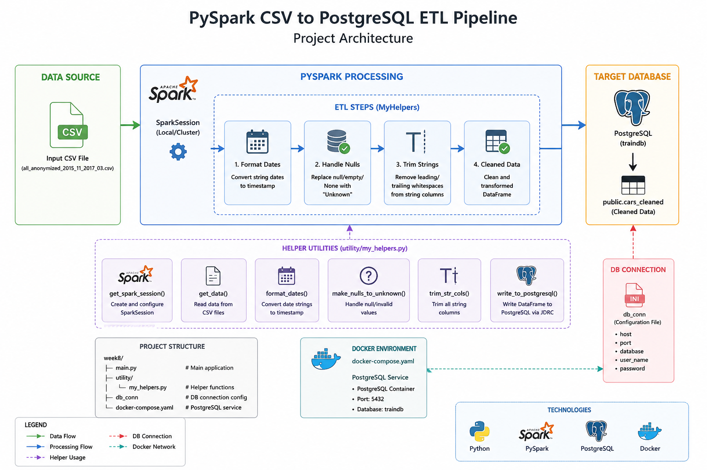

## Project Architecture



## Project Structure

```
project
├── main.py
├── db_conn
├── docker-compose.yaml
└── utility/
    └── my_helpers.py
```

### Terminal Output
```
[train@DESKTOP-8K4RDO7 week7]$ /usr/bin/python /home/train/week7/spark/examples/Homework#8/main.py
WARNING: Using incubator modules: jdk.incubator.vector
Using Spark's default log4j profile: org/apache/spark/log4j2-defaults.properties
26/05/05 21:06:18 WARN Utils: Your hostname, DESKTOP-8K4RDO7, resolves to a loopback address: 127.0.1.1; using 10.255.255.254 instead (on interface lo)
26/05/05 21:06:18 WARN Utils: Set SPARK_LOCAL_IP if you need to bind to another address
:: loading settings :: url = jar:file:/home/train/.local/lib/python3.12/site-packages/pyspark/jars/ivy-2.5.3.jar!/org/apache/ivy/core/settings/ivysettings.xml
Ivy Default Cache set to: /home/train/.ivy2.5.2/cache
The jars for the packages stored in: /home/train/.ivy2.5.2/jars
org.postgresql#postgresql added as a dependency
:: resolving dependencies :: org.apache.spark#spark-submit-parent-65ee7b5a-ca81-459b-8f53-d9fbb7e7c9b1;1.0
        confs: [default]
        found org.postgresql#postgresql;42.7.10 in central
        found org.checkerframework#checker-qual;3.52.0 in central
:: resolution report :: resolve 141ms :: artifacts dl 3ms
        :: modules in use:
        org.checkerframework#checker-qual;3.52.0 from central in [default]
        org.postgresql#postgresql;42.7.10 from central in [default]
        ---------------------------------------------------------------------
        |                  |            modules            ||   artifacts   |
        |       conf       | number| search|dwnlded|evicted|| number|dwnlded|
        ---------------------------------------------------------------------
        |      default     |   2   |   0   |   0   |   0   ||   2   |   0   |
        ---------------------------------------------------------------------
:: retrieving :: org.apache.spark#spark-submit-parent-65ee7b5a-ca81-459b-8f53-d9fbb7e7c9b1
        confs: [default]
        0 artifacts copied, 2 already retrieved (0kB/5ms)
26/05/05 21:06:18 WARN NativeCodeLoader: Unable to load native-hadoop library for your platform... using builtin-java classes where applicable
Using Spark's default log4j profile: org/apache/spark/log4j2-defaults.properties
Setting default log level to "WARN".
To adjust logging level use sc.setLogLevel(newLevel). For SparkR, use setLogLevel(newLevel).
+-----+-------+-------+----------------+-------------------+------------+---------+----------+--------+------------+----------+----------+---------+--------------------------+-------------------------+---------+
|maker|model  |mileage|manufacture_year|engine_displacement|engine_power|body_type|color_slug|stk_year|transmission|door_count|seat_count|fuel_type|date_created              |date_last_seen           |price_eur|
+-----+-------+-------+----------------+-------------------+------------+---------+----------+--------+------------+----------+----------+---------+--------------------------+-------------------------+---------+
|ford |galaxy |151000 |2011            |2000               |103         |NULL     |NULL      |None    |man         |5         |7         |diesel   |2015-11-14 20:10:06.838319|2016-01-27 22:40:15.46361|10584.75 |
|skoda|octavia|143476 |2012            |2000               |81          |NULL     |NULL      |None    |man         |5         |5         |diesel   |2015-11-14 20:10:06.853411|2016-01-27 22:40:15.46361|8882.31  |
|bmw  |NULL   |97676  |2010            |1995               |85          |NULL     |NULL      |None    |man         |5         |5         |diesel   |2015-11-14 20:10:06.861792|2016-01-27 22:40:15.46361|12065.06 |
|skoda|fabia  |111970 |2004            |1200               |47          |NULL     |NULL      |None    |man         |5         |5         |gasoline |2015-11-14 20:10:06.872313|2016-01-27 22:40:15.46361|2960.77  |
|skoda|fabia  |128886 |2004            |1200               |47          |NULL     |NULL      |None    |man         |5         |5         |gasoline |2015-11-14 20:10:06.880335|2016-01-27 22:40:15.46361|2738.71  |
+-----+-------+-------+----------------+-------------------+------------+---------+----------+--------+------------+----------+----------+---------+--------------------------+-------------------------+---------+
only showing top 5 rows
root
 |-- maker: string (nullable = true)
 |-- model: string (nullable = true)
 |-- mileage: integer (nullable = true)
 |-- manufacture_year: integer (nullable = true)
 |-- engine_displacement: integer (nullable = true)
 |-- engine_power: integer (nullable = true)
 |-- body_type: string (nullable = true)
 |-- color_slug: string (nullable = true)
 |-- stk_year: string (nullable = true)
 |-- transmission: string (nullable = true)
 |-- door_count: string (nullable = true)
 |-- seat_count: string (nullable = true)
 |-- fuel_type: string (nullable = true)
 |-- date_created: timestamp (nullable = true)
 |-- date_last_seen: timestamp (nullable = true)
 |-- price_eur: double (nullable = true)

---- Format Dates ----
+-----+-------+-------+----------------+-------------------+------------+---------+----------+--------+------------+----------+----------+---------+-------------------+-------------------+---------+
|maker|model  |mileage|manufacture_year|engine_displacement|engine_power|body_type|color_slug|stk_year|transmission|door_count|seat_count|fuel_type|date_created       |date_last_seen     |price_eur|
+-----+-------+-------+----------------+-------------------+------------+---------+----------+--------+------------+----------+----------+---------+-------------------+-------------------+---------+
|ford |galaxy |151000 |2011            |2000               |103         |NULL     |NULL      |None    |man         |5         |7         |diesel   |2015-11-14 20:10:06|2016-01-27 22:40:15|10584.75 |
|skoda|octavia|143476 |2012            |2000               |81          |NULL     |NULL      |None    |man         |5         |5         |diesel   |2015-11-14 20:10:06|2016-01-27 22:40:15|8882.31  |
|bmw  |NULL   |97676  |2010            |1995               |85          |NULL     |NULL      |None    |man         |5         |5         |diesel   |2015-11-14 20:10:06|2016-01-27 22:40:15|12065.06 |
|skoda|fabia  |111970 |2004            |1200               |47          |NULL     |NULL      |None    |man         |5         |5         |gasoline |2015-11-14 20:10:06|2016-01-27 22:40:15|2960.77  |
|skoda|fabia  |128886 |2004            |1200               |47          |NULL     |NULL      |None    |man         |5         |5         |gasoline |2015-11-14 20:10:06|2016-01-27 22:40:15|2738.71  |
+-----+-------+-------+----------------+-------------------+------------+---------+----------+--------+------------+----------+----------+---------+-------------------+-------------------+---------+
only showing top 5 rows
root
 |-- maker: string (nullable = true)
 |-- model: string (nullable = true)
 |-- mileage: integer (nullable = true)
 |-- manufacture_year: integer (nullable = true)
 |-- engine_displacement: integer (nullable = true)
 |-- engine_power: integer (nullable = true)
 |-- body_type: string (nullable = true)
 |-- color_slug: string (nullable = true)
 |-- stk_year: string (nullable = true)
 |-- transmission: string (nullable = true)
 |-- door_count: string (nullable = true)
 |-- seat_count: string (nullable = true)
 |-- fuel_type: string (nullable = true)
 |-- date_created: timestamp (nullable = true)
 |-- date_last_seen: timestamp (nullable = true)
 |-- price_eur: double (nullable = true)

---- Make nulls to Unknown ----
+-----+-------+-------+----------------+-------------------+------------+---------+----------+--------+------------+----------+----------+---------+-------------------+-------------------+---------+
|maker|  model|mileage|manufacture_year|engine_displacement|engine_power|body_type|color_slug|stk_year|transmission|door_count|seat_count|fuel_type|       date_created|     date_last_seen|price_eur|
+-----+-------+-------+----------------+-------------------+------------+---------+----------+--------+------------+----------+----------+---------+-------------------+-------------------+---------+
| ford| galaxy| 151000|            2011|               2000|         103|  Unknown|   Unknown| Unknown|         man|         5|         7|   diesel|2015-11-14 20:10:06|2016-01-27 22:40:15| 10584.75|
|skoda|octavia| 143476|            2012|               2000|          81|  Unknown|   Unknown| Unknown|         man|         5|         5|   diesel|2015-11-14 20:10:06|2016-01-27 22:40:15|  8882.31|
|  bmw|Unknown|  97676|            2010|               1995|          85|  Unknown|   Unknown| Unknown|         man|         5|         5|   diesel|2015-11-14 20:10:06|2016-01-27 22:40:15| 12065.06|
|skoda|  fabia| 111970|            2004|               1200|          47|  Unknown|   Unknown| Unknown|         man|         5|         5| gasoline|2015-11-14 20:10:06|2016-01-27 22:40:15|  2960.77|
|skoda|  fabia| 128886|            2004|               1200|          47|  Unknown|   Unknown| Unknown|         man|         5|         5| gasoline|2015-11-14 20:10:06|2016-01-27 22:40:15|  2738.71|
+-----+-------+-------+----------------+-------------------+------------+---------+----------+--------+------------+----------+----------+---------+-------------------+-------------------+---------+
only showing top 5 rows
root
 |-- maker: string (nullable = true)
 |-- model: string (nullable = true)
 |-- mileage: integer (nullable = true)
 |-- manufacture_year: integer (nullable = true)
 |-- engine_displacement: integer (nullable = true)
 |-- engine_power: integer (nullable = true)
 |-- body_type: string (nullable = true)
 |-- color_slug: string (nullable = true)
 |-- stk_year: string (nullable = true)
 |-- transmission: string (nullable = true)
 |-- door_count: string (nullable = true)
 |-- seat_count: string (nullable = true)
 |-- fuel_type: string (nullable = true)
 |-- date_created: timestamp (nullable = true)
 |-- date_last_seen: timestamp (nullable = true)
 |-- price_eur: double (nullable = true)

---- Trim string columns ----
root
 |-- maker: string (nullable = true)
 |-- model: string (nullable = true)
 |-- mileage: integer (nullable = true)
 |-- manufacture_year: integer (nullable = true)
 |-- engine_displacement: integer (nullable = true)
 |-- engine_power: integer (nullable = true)
 |-- body_type: string (nullable = true)
 |-- color_slug: string (nullable = true)
 |-- stk_year: string (nullable = true)
 |-- transmission: string (nullable = true)
 |-- door_count: string (nullable = true)
 |-- seat_count: string (nullable = true)
 |-- fuel_type: string (nullable = true)
 |-- date_created: timestamp (nullable = true)
 |-- date_last_seen: timestamp (nullable = true)
 |-- price_eur: double (nullable = true)

+-----+-------+-------+----------------+-------------------+------------+---------+----------+--------+------------+----------+----------+---------+-------------------+-------------------+---------+
|maker|  model|mileage|manufacture_year|engine_displacement|engine_power|body_type|color_slug|stk_year|transmission|door_count|seat_count|fuel_type|       date_created|     date_last_seen|price_eur|
+-----+-------+-------+----------------+-------------------+------------+---------+----------+--------+------------+----------+----------+---------+-------------------+-------------------+---------+
| ford| galaxy| 151000|            2011|               2000|         103|  Unknown|   Unknown| Unknown|         man|         5|         7|   diesel|2015-11-14 20:10:06|2016-01-27 22:40:15| 10584.75|
|skoda|octavia| 143476|            2012|               2000|          81|  Unknown|   Unknown| Unknown|         man|         5|         5|   diesel|2015-11-14 20:10:06|2016-01-27 22:40:15|  8882.31|
|  bmw|Unknown|  97676|            2010|               1995|          85|  Unknown|   Unknown| Unknown|         man|         5|         5|   diesel|2015-11-14 20:10:06|2016-01-27 22:40:15| 12065.06|
|skoda|  fabia| 111970|            2004|               1200|          47|  Unknown|   Unknown| Unknown|         man|         5|         5| gasoline|2015-11-14 20:10:06|2016-01-27 22:40:15|  2960.77|
|skoda|  fabia| 128886|            2004|               1200|          47|  Unknown|   Unknown| Unknown|         man|         5|         5| gasoline|2015-11-14 20:10:06|2016-01-27 22:40:15|  2738.71|
+-----+-------+-------+----------------+-------------------+------------+---------+----------+--------+------------+----------+----------+---------+-------------------+-------------------+---------+
only showing top 5 rows
---- Writed to Postgresql ----
26/05/05 21:06:29 WARN SparkStringUtils: Truncated the string representation of a plan since it was too large. This behavior can be adjusted by setting 'spark.sql.debug.maxToStringFields'.
[train@DESKTOP-8K4RDO7 week7]$ 

================================================================================================================================================================================================================
```

```bash
docker exec -it postgresql bash
```
```
psql -h localhost -p 5432 -U postgres -d traindb
```

- traindb=# \c

```text
You are now connected to database "traindb" as user "postgres".
traindb=# \dt
            List of relations
 Schema |     Name     | Type  |  Owner   
--------+--------------+-------+----------
 public | cars_cleaned | table | postgres
 public | churn_spark  | table | train
(2 rows)
```

```sql
SELECT COUNT(*) FROM cars_cleaned;
```

```text
  count  
---------
 2043434
(1 row)
```

```sql
SELECT * FROM public.cars_cleaned LIMIT 5;
```

```text
  maker  |  model  | mileage | manufacture_year | engine_displacement | engine_power | body_type | color_slug | stk_year | transmission | door_count | seat_count | fuel_type |      date_created      |     date_last_seen     | price_eur 
---------+---------+---------+------------------+---------------------+--------------+-----------+------------+----------+--------------+------------+------------+-----------+------------------------+------------------------+-----------
 Unknown | Unknown |   49500 |             2013 |                1390 |          110 | Unknown   | Unknown    | Unknown  | auto         | 4          | 5          | gasoline  | 2016-01-03 09:23:50+00 | 2016-03-03 09:30:06+00 |  25852.89
 Unknown | Unknown |   49500 |             2013 |                1390 |          110 | Unknown   | Unknown    | Unknown  | auto         | 4          | 5          | gasoline  | 2016-01-03 09:23:50+00 | 2016-03-03 09:30:06+00 |  25852.89
 Unknown | Unknown |   53200 |             2011 |                1968 |          120 | Unknown   | Unknown    | Unknown  | man          | 4          | 5          | diesel    | 2016-01-03 09:24:04+00 | 2016-03-03 09:30:06+00 |  25852.89
 Unknown | Unknown |    9700 |             2014 |                1390 |           90 | Unknown   | Unknown    | Unknown  | auto         | 4          | 5          | gasoline  | 2016-01-03 09:24:04+00 | 2016-01-05 12:55:34+00 |  21852.44
 rover   | Unknown |   87500 |             2010 |                3630 |          200 | Unknown   | Unknown    | Unknown  | auto         | 4          | 5          | diesel    | 2016-01-03 09:24:04+00 | 2016-01-19 00:38:22+00 |  32853.66
(5 rows)
```

- traindb=# \d public.cars_cleaned

```text
                           Table "public.cars_cleaned"
       Column        |           Type           | Collation | Nullable | Default 
---------------------+--------------------------+-----------+----------+---------
 maker               | text                     |           |          | 
 model               | text                     |           |          | 
 mileage             | integer                  |           |          | 
 manufacture_year    | integer                  |           |          | 
 engine_displacement | integer                  |           |          | 
 engine_power        | integer                  |           |          | 
 body_type           | text                     |           |          | 
 color_slug          | text                     |           |          | 
 stk_year            | text                     |           |          | 
 transmission        | text                     |           |          | 
 door_count          | text                     |           |          | 
 seat_count          | text                     |           |          | 
 fuel_type           | text                     |           |          | 
 date_created        | timestamp with time zone |           |          | 
 date_last_seen      | timestamp with time zone |           |          | 
 price_eur           | double precision         |           |          | 
```
